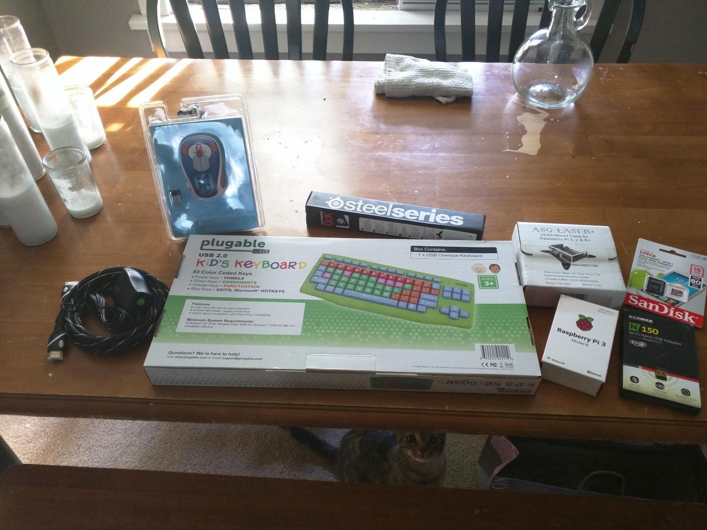
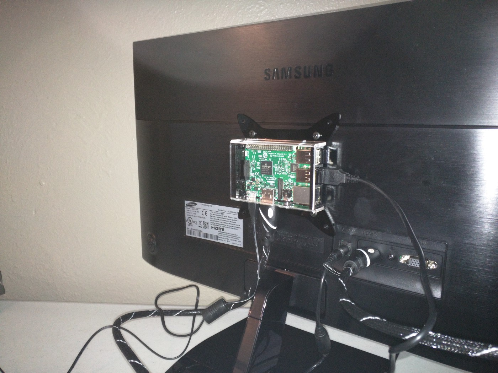
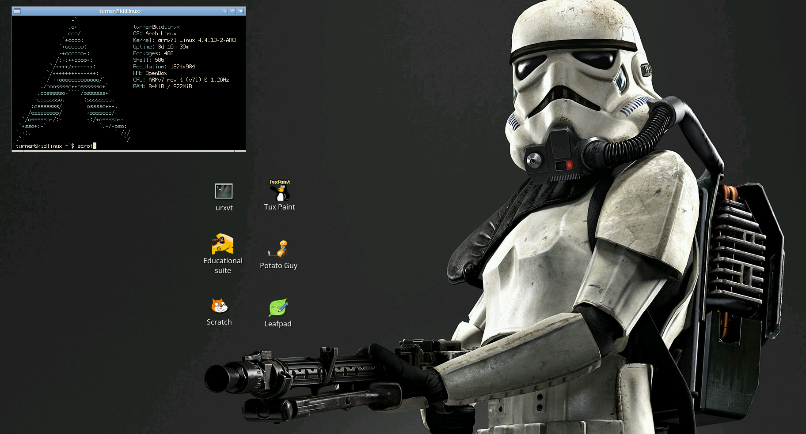
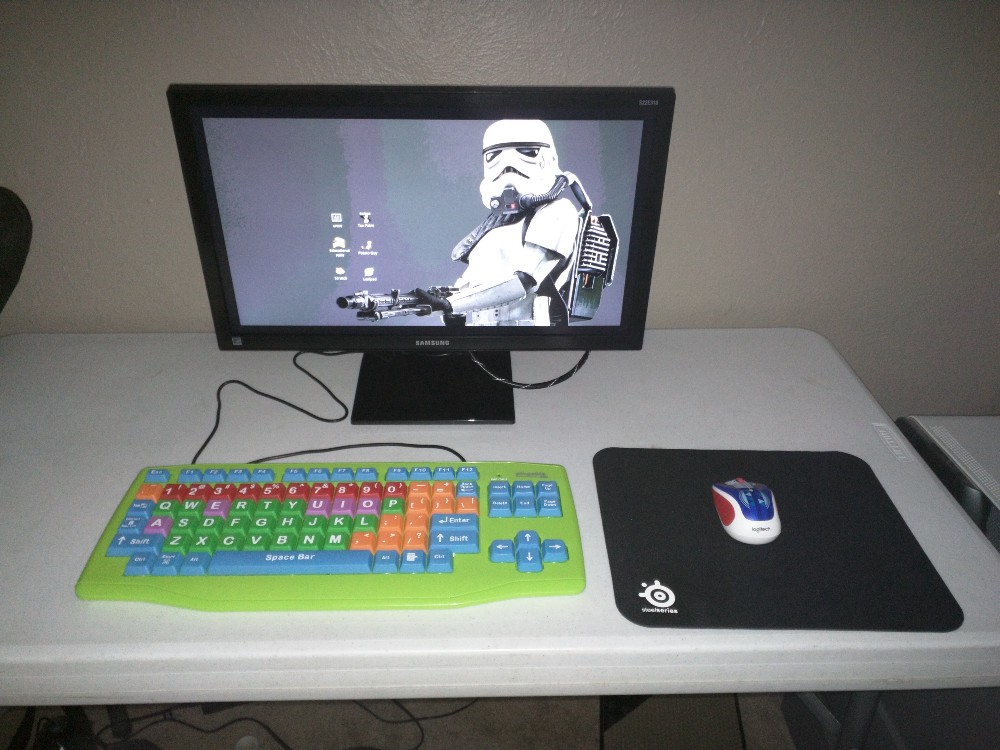

# Every Little Hacker needs a Little Linux Computer
* By: Austin Jackson (vesche)
* Dated: 09/20/2016

I was visiting my sister recently when I was shocked to discover that my nearly five-year-old nephew had grown into a full-blown walking, talking, little human being! So, naturally my first question was, “Where is this little hackers little computer?” To which I was sadly told that he did not have a computer of his own! Well, that just won’t do.

I know what you’re probably all thinking, why isn’t this kid’s adorable face on every possible toddler related product currently on the market? Rest assured, I constantly remind my sister of how she could be exploiting his cuteness for millions of dollars- but I digress. Where were we? Oh right, Linux.

Let’s talk hardware. If we’re building this little dude a Linux computer and we’re “ballin’ on a budget”, there’s no better choice than a Raspberry Pi. I mean <i>he is</i> a hacker in training, right? His typing (and well, hand coordination in general) isn’t that great yet, so we’ll need an over-sized keyboard. A big mouse pad, and a good wireless mouse will do well. Oh, and how about a VESA mount case for the Raspberry Pi so it stays out of the way? All of that should do nicely.

* [Raspberry Pi 3 Model B Motherboard](https://www.raspberrypi.org/products/raspberry-pi-3-model-b/)
* [USB Kids Keyboard (Extra Large Keys)](http://a.co/12wGpGI)
* [SteelSeries QcK Gaming Mouse Pad](http://a.co/avmX8p4)
* [VESA Mount Case for Raspberry Pi 3](http://a.co/dQualAb)

Everything else up there is pretty generic, an HDMI cable, power cable, wireless mouse, wifi adapter (for initial setup), and a SD card. Grand total for all these parts was a little under $150.

Full disclosure, I don’t have kids. However, I can imagine “mo’ wires mo’ problems” am I right? The VESA mount I purchased for the Raspberry Pi alleviates a lot of these problems by keeping everything shoved behind the monitor.

Alright, let’s get to the meat of this puppy. What’s going on under the hood? Seeing as this kid is *the real deal* he’s gonna run Arch Linux. I can see his little UNIX(-like) beard coming in already! Joking aside, since the Raspberry Pi uses an ARM processor hop on over to [archlinuxarm.org](https://archlinuxarm.org/platforms/armv8/broadcom/raspberry-pi-3) for information on how to install Arch Linux on your Pi.

After a bit of tinkering, we’re ready to start talking software. I first installed [Openbox](https://wiki.archlinux.org/index.php/openbox) with [nodm](https://wiki.archlinux.org/index.php/Nodm), which should make the computer easy to just turn on and get going. I was very fortunate to come across a pair of blog posts by a Mr. Alan Moore (no, not the comic book guy) titled: Building a Linux System for a Child [Part 1](http://www.alandmoore.com/blog/2013/01/07/building-a-linux-system-for-a-child-part-1-what-and-why/) & [Part 2](http://www.alandmoore.com/blog/2013/01/31/building-a-linux-system-for-a-child-part2-distros-and-software/). It’s interesting to note that in the second post Linux distros specifically for children’s education are discussed including [DouDouLinux](http://www.doudoulinux.org/), [Qimo](https://en.wikipedia.org/wiki/Qimo_4_Kids), [SkoleLinux](https://en.wikipedia.org/wiki/Skolelinux), and [Edbuntu](https://www.edubuntu.org/). Also, not discussed in the article (but popular) are [Sugar](https://www.sugarlabs.org/) and [Ubermix](http://www.ubermix.org/). It was awesome to discover that so many Linux distributions exist solely for children’s education, and perhaps it might be easier for some of you to just install one of these distros instead.

After looking at a lot of software for this youngin’ I settled on installing [Tux Paint](http://www.tuxpaint.org/), [GCompris Educational Suite](http://gcompris.net/index-en.html), [Potato Guy](https://www.thinkpenguin.com/gnu-linux/potato-guy), [Scratch](https://scratch.mit.edu/), and [Leafpad](http://tarot.freeshell.org/leafpad/).

These programs are a ton of fun! If any of you had a Mac in the early 90's, Tux Paint is essentially a free version of Kid Pix. The GCompris Educational Suite is an endless set of games focused around all sorts of early education subjects. Potato Guy is a fun little dress-up game staring the classic Mr. Potato Head.

I included Scratch and Leafpad in hopes that my nephew will poke around with them as he gets older. I’ll be sure to replace his keyboard as his fingers get more agile. Here’s to his first battle station. Uncle out.

