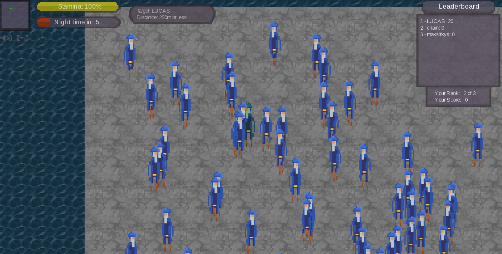
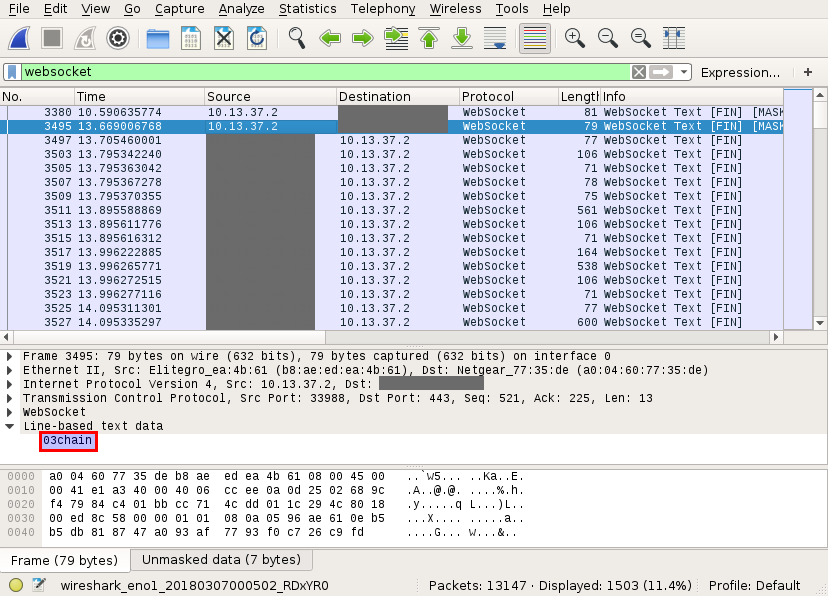
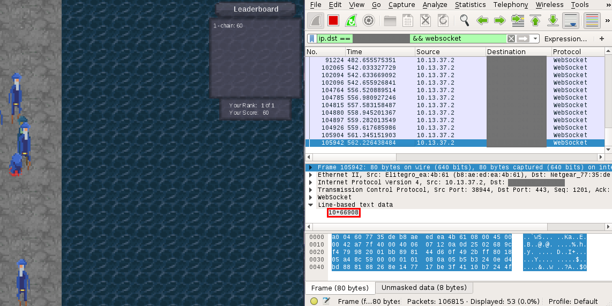

# Creating An HTML5 Game Bot Using Python
* By: Austin Jackson (vesche)
* Dated: 03/07/2018

This article is also avaliable in [Chinese (中文)](https://juejin.im/post/5aa9e7645188257bf550c745)!

**TL;DR:** I created a bot for the game [stabby.io](http://stabby.io/), [GitHub repo here](https://github.com/vesche/stabbybot).

A few weeks back, I was having a very boring night and stumbled upon [stabby.io](http://stabby.io/) and quickly had an IO game addiction relapse (think agar, but I've been through treatment). You spawn into a small map of players identical to yourself and can kill anyone around you. The vast majority of players around you are computer players, and you have to determine who the human players are.



As my night dragged on somewhere in the back of my mind Eric S. Raymond reminded me that [boredom and drudgery are evil](http://www.catb.org/~esr/faqs/hacker-howto.html#believe3)... I also remembered that the guy who runs [LiveOverflow](http://www.liveoverflow.com/) had recently yelled at me (via video) to ["Stop wasting your time and learn more hacking!"](https://www.youtube.com/watch?v=AMMOErxtahk) Thus I decided to turn my boredom and unproductiveness into a fun programming project, and I set out to create a Python bot to play stabby for me!

Before I get into it, the developer of stabby is a very cool guy named soulfoam. He streams programming and gamedev on his [Twitch channel](https://www.twitch.tv/soulfoamtv), and he gave me permission to create this bot and share it with the world.

My initial thought was to use [autopy](http://www.autopy.org/) to capture the screen and send mouse movements based on image analysis (RIP the Runescape bots of my youth). I quickly abandoned this line of thinking as I realized that there was a direct way of interacting with the game- [WebSockets](https://en.wikipedia.org/wiki/WebSocket)! Because stabby is an HTML5 real-time multiplayer game it uses WebSockets for a persistent connection between the client and a server so both parties can send data at any time.


So what we need to do is take a look at the WebSocket communication between the client and server. If it's possible to understand messages sent **from** the server, and recreate messages sent **to** the server then we might be able to play the game through direct WebSocket communication. Let's start a game of stabby and crack open [Wireshark](https://www.wireshark.org/) to get a look at the traffic.



**Note:** I'm censoring the stabby server IP above so it doesn't get slammed, I don't provide the IP with stabbybot so you'll need to get that on your own. This is to avoid script kiddies abusing the bot. It's a very simple task to get the server IP if you're interested.

Where were we? Oh right- Mmm, juicy WebSocket packets. We now see the first sign that we are on the right track! I set my username to `chain` before starting the game, and within the WebSocket data of the second packet is `03chain` being sent to the server. This is how everyone in-game knows my name!

Upon further analysis of the packet capture I determined what the client is sending to the server to initiate the connection. Here's what we need to recreate in Python:
* Connect to the stabby WebSocket server
* Send the current game version, which as of writing this is `000.0.4.3`
* Conduct a [WebSocket Ping/Pong](https://tools.ietf.org/html/rfc6455#section-5.5.2)
* Send our in-game username to the server
* Listen for messages from the server

To connect to the WebSocket server with Python I'm going to use the [websocket-client](https://pypi.python.org/pypi/websocket-client) library. Now let's hack together some code that does what we outlined above...

```python
import websocket

# create a websocket object
ws = websocket.WebSocket()

# connect to the stabby.io server
ws.connect('ws://%s:443' % server_ip, origin='http://stabby.io')

# send the current game version
ws.send('000.0.4.3')

# force a websocket ping/pong
ws.pong('')

# send our username
ws.send('03%s' % 'stabbybot')

try:
    while True:
        # listen for messages from the server
        print(ws.recv())
except KeyboardInterrupt:
    pass

ws.close()
```

Big Money, No Whammies... We did it Reddit, server messages!
```
030,day
15xx,60|stabbybot,0|
162,2,0
05+36551,186.7,131.0,walking,left|+58036,23.1,122.8,walking,right|_20986,55.2,71.7,idle,left|_47394,70.9,84.9,walking,right|_58354,10.4,16.2,walking,right|_81344,61.0,27.8,walking,left|+77108,107.5,8.9,walking,left|_96763,118.8,71.7,walking,left|_23992,104.4,24.1,walking,right|+30650,118.4,8.0,idle,left|+11693,186.7,35.5,walking,left|+34643,186.7,118.3,walking,left|+65406,83.9,33.3,idle,right|+24414,186.7,136.3,walking,left|+00863,75.2,35.3,walking,left|_57248,39.0,51.3,walking,right|_98132,165.2,10.0,walking,right|_45741,179.2,5.2,walking,right|+57840,186.7,45.3,walking,left|+70676,186.7,135.7,walking,left|+39478,90.8,63.3,walking,left|_51961,166.7,138.7,idle,right|+85034,148.4,7.7,idle,right|_72926,62.4,23.7,walking,left|_25474,9.6,58.0,idle,left|0,4.0,1.0,idle,left|_52426,61.0,128.4,walking,left|_00194,67.5,96.1,walking,left|+12906,170.7,33.7,walking,right|_67508,87.2,93.3,walking,left|+51085,140.3,34.2,idle,right|_67544,170.1,100.7,idle,right|_77761,158.5,127.6,idle,left|_25113,38.4,111.2,walking,left|
08100,20.5,227.68056,227.68056,0.0,0.0
18t,xx,250m or less
...
```

These are messages being sent from the server to the client. We can now see upon login we get some information about what time of day it is in-game: `030,day`. And then some perception data starts rolling in: `05+36551,186.7,131.0,walking,left|+58036,23.1,122.8,walking,right|...`. It looks like player id, coordinates, status, and direction facing. We can now start fiddling around and reverse engineering the game communication to begin understanding what the client & server are sending to each other.

For instance, what happens when we kill someone in game?



This time with Wireshark I filtered specifically for WebSocket traffic going to (`ip.dst`) the server. Upon killing someone `10` and then the player id is sent to the server. If you haven't figured it out yet, everything sent and received by the server begins with a two digit number or `event code` as I call it. There are nearly twenty of these different event codes, and I still don't know what all of them do. However, I was able to map out some of the important ones:

```python
EVENTS = {
    '03': 'login',
    '05': 'perception',
    '07': 'move',
    '09': 'time_of_day',
    '10': 'kill',
    '13': 'killed_by',
    '14': 'kill_info',
    '15': 'stats',
    '18': 'target'
}
```

## Creating a very simple bot

With this information we can being to structure our bot!
```
.
├── main.py  - Entry point for the bot. Will connect to the stabby 
│              server and contain the main loop.
├── comm.py  - Process all incoming and outgoing messages.
├── state.py - Keep track of the current state of the game.
├── brain.py - All decision making the bot will do.
└── log.py   - Provide any logging the bot might need.
```

The main loop in `main.py` will happen like so:
* Receive incoming server messages.
* Send server messages to `comm.py` for processing.
* Processed data will be stored in the current game state (`state.py`).
* The current game state will be given to `brain.py`.
* Decisions will be made based on the game state.

Let's take a look at how we can implement a very basic bot with this structure that will **move to the location of where the last player was killed**. When someone is killed in the game, everyone is broadcast a message like so `14+12906,120.2,64.8,seth`. This is event code `14` followed by a comma separated player id, x & y coordinates, and the username of the killer. If we'd then like to walk to this location we would send event code `07` followed by a comma separated x & y coordinates.

First, let's first create the game state which will keep track of the kill information:

```python
# state.py

class GameState():
    """Keeps track of the current state of the game for stabbybot."""

    def __init__(self):
        self.game_state = {
            'kill_info': {'uid': None, 'x': None, 'y': None, 'killer': None},
        }

    def kill_info(self, data):
        uid, x, y, killer = data.split(',')
        self.game_state['kill_info'] = {'uid': uid, 'x': x, 'y': y, 'killer': killer}
```

Next, we will create communication code for processing the _incoming_ kill information (and hand it off to the game state), and also to send a move command  _outgoing_:

```python
# comm.py

def incoming(gs, raw_data):
    """Handle incoming game data."""

    event_code = raw_data[:2]
    data = raw_data[2:]

    if event_code == '14':
        gs.kill_info(data)

class Outgoing(object):
    """Handle outgoing game data."""

    def move(self, x, y):
        x = x.split('.')[0]
        y = y.split('.')[0]
        self.ws.send('%s%s,%s' % ('07', x, y))
```

Here is the decision making which will take the current state of the game and if someone is killed it will move our player to that location:

```python
# brain.py

class GenOne(object):
    """Generation 1 of the stabbybot. He's pretty dumb at the moment lol."""

    def __init__(self, outgoing):
        self.outgoing = outgoing
        self.kill_info = {'uid': None, 'x': None, 'y': None, 'killer': None}

    def testA(self, game_state):
        """Walks to the spot last player died."""
        if self.kill_info != game_state['kill_info']:
            self.kill_info = game_state['kill_info']
        
            if self.kill_info['killer']:
                print('New kill by %s! On the way to (%s, %s)!'
                    % (self.kill_info['killer'], self.kill_info['x'], self.kill_info['y']))
                self.outgoing.move(self.kill_info['x'], self.kill_info['y'])
```

Finally, here is our updated main file which will connect to the server and execute the main loop outlined above:

```python
# main.py

import websocket

import state
import comm
import brain

ws = websocket.WebSocket()
ws.connect('ws://%s:443' % server_ip, origin='http://stabby.io')
ws.send('000.0.4.3')
ws.pong('')
ws.send('03%s' % 'stabbybot')

# instantiate classes
gs = state.GameState()
outgoing = comm.Outgoing(ws)
bot = brain.GenOne(outgoing)

while True:
    # recieve incoming server messages
    raw_data = ws.recv()

    # process incoming data
    comm.incoming(gs, raw_data)

    # make decisions
    bot.testA(gs.game_state)

ws.close()
```

When this bot is run, it will do exactly as expected. When someone dies, the bot will strut on over to where they were killed. This isn't too exciting, but it is definitely a good start! We are now able to send and receive game data to do a specific task in game.

## Creating a decent bot

The structure we created for the simple bot above can then be expanded to add much more functionality, check out the [stabbybot GitHub repo](https://github.com/vesche/stabbybot) to see how `comm.py` and `state.py` are fleshed out to include all the bells and whistles.

Now we're going to be attempting to create a bot that can actually compete with average skill human players. The easiest way to be successful in stabby is to be patient, walk around, wait to see someone be killed, and then kill the player you saw kill someone else.

So here's what we need this bot to be able to do:
* Walk around randomly.
* Check if anyone has been killed -> `game_state['kill_info']`
* If someone has been killed, check the current perception data -> `game_state['perception']`
* Determine if anyone was close enough to the kill to be the murderer...
* Take out these other players for points and glory!

Let's take a look at `brain.py` and write a `GenTwo` class! The first easy part to implement is getting the bot to walk around randomly.

```python
class GenTwo(object):
    """Generation 2 of the stabbybot. Look at the little guy go!"""

    def __init__(self, outgoing):
        self.outgoing = outgoing
        self.walk_lock = False
        self.walk_count = 0
        self.max_step_count = 600
    
    def main(self, game_state):
        self.random_walk(game_state)
    
    def is_locked(self):
        # check if the action is locked
        if (self.walk_lock): # other locks here
            return True
        return False

    def random_walk(self, game_state):
        # check if "locked"
        if not self.is_locked():
            # get a random x & y coordinate
            rand_x = random.randint(40, 400)
            rand_y = random.randint(40, 400)
            # start moving to that random x & y coordinate
            self.outgoing.move(str(rand_x), str(rand_y))
            # apply the lock
            self.walk_lock = True
        
        # check if walk has completed
        if self.max_step_count < self.walk_count:
            # unlock
            self.walk_lock = False
            self.walk_count = 0
        
        # increment the walk counter
        self.walk_count += 1
```

One important thing that I do above is create a locking mechanism. Because the bot is going to be doing many actions, we don't want the bot to get confused and start killing someone halfway through a random walk. When our player starts randomly walking it will always wait 600 "steps" (events) before attempting to walk again. This was calculated as the max amount of steps from one corner of the map to the other.

Alright, now on to the meat of this puppy. We need to check for the most recent kill, and then compare this to the current perception data.

```python
import collections

class GenTwo(object):

    def __init__(self, outgoing):
        self.outgoing = outgoing

        # keep track of most recent kill
        self.kill_info = {'uid': None, 'x': None, 'y': None, 'killer': None}
    
    def main(self, game_state):
        # by priority
        self.go_for_kill(game_state)
        self.random_walk(game_state)

    def go_for_kill(self, game_state):
        # check if a new kill has happened
        if self.kill_info != game_state['kill_info']:
            self.kill_info = game_state['kill_info']

            # x & y coordinates that the kill happened at
            kill_x = float(game_state['kill_info']['x'])
            kill_y = float(game_state['kill_info']['y'])

            # create an OrderedDict with surrounding players id, and x & y coord
            player_coords = collections.OrderedDict()
            for i in game_state['perception']:
                player_x = float(i['x'])
                player_y = float(i['y'])
                player_uid = i['uid']
                player_coords[player_uid] = (player_x, player_y)
```

Now within `go_for_kill` we have a `kill_x` & `kill_y` coordinate of where the most recent kill went down. We also have an ordered dictionary of player ID's with x & y coordinates. When a player is killed in game this ordered dictionary will look something like this: `OrderedDict([('+56523', (315.8, 197.5)), ('+93735', (497.4, 130.7)), ...])`. The only thing left to do is to determine who was closest to the kill, and if they were close enough that our bot should take them out!

So now our task is clear, we need to find the closest coordinate from a set of coordinates. This is often called [nearest neighbor search](https://en.wikipedia.org/wiki/Nearest_neighbor_search) and we can accomplish it with [k-d trees](https://en.wikipedia.org/wiki/K-d_tree). I'm going to use the awesome Python library [SciPy](https://www.scipy.org/) to do this by using [scipy.spatial.KDTree.query](https://docs.scipy.org/doc/scipy/reference/generated/scipy.spatial.KDTree.query.html#scipy.spatial.KDTree.query).

```python
from scipy import spatial

    # ...

    def go_for_kill(self, game_state):
        if self.kill_info != game_state['kill_info']:
            self.kill_info = game_state['kill_info']
            self.kill_lock = True

            kill_x = float(game_state['kill_info']['x'])
            kill_y = float(game_state['kill_info']['y'])

            player_coords = collections.OrderedDict()
            for i in game_state['perception']:
                player_x = float(i['x'])
                player_y = float(i['y'])
                player_uid = i['uid']
                player_coords[player_uid] = (player_x, player_y)

            # get player closest to kill coordinates
            tree = spatial.KDTree(list(player_coords.values()))
            distance, index = tree.query([(kill_x, kill_y)])

            # go for kill if a player was close enough to the kill
            if distance < 10:
                kill_uid = list(player_coords.keys())[int(index)]
                self.outgoing.kill(kill_uid)
```

If you'd like to see this all together [here is the complete brain.py within stabbybot](https://github.com/vesche/stabbybot/blob/master/stabbybot/brain.py).

Let's run this bot now and see how it fares:
```
$ python stabbybot/main.py -s <server_ip> -u stabbybot

[+] MOVE: (228, 56)
[+] STAT: [('sam5', '2146'), ('jjkiller', '397'), ('QWERTY', '393'), ('N-chan', '240'), ('stabbybot', '0')]
[+] KILL: jjkiller (62.798412, 16.391998)
[+] STAT: [('sam5', '2146'), ('jjkiller', '407'), ('QWERTY', '393'), ('N-chan', '240'), ('stabbybot', '0')]
[+] KILL: N-chan (322.9627, 235.68994)
[+] STAT: [('sam5', '2146'), ('jjkiller', '407'), ('QWERTY', '393'), ('N-chan', '250'), ('stabbybot', '0')]
[+] KILL: jjkiller (79.39742, 11.73037)
[+] STAT: [('sam5', '2146'), ('jjkiller', '417'), ('QWERTY', '393'), ('N-chan', '250'), ('stabbybot', '0')]
[+] KILL: QWERTY (241.24649, 253.66882)
[+] STAT: [('sam5', '2146'), ('QWERTY', '505'), ('jjkiller', '417'), ('stabbybot', '0')]
[+] KILL: sam5 (91.02979, 41.00656)
[+] STAT: [('sam5', '2156'), ('QWERTY', '505'), ('jjkiller', '417'), ('stabbybot', '0')]
[+] MOVE: (287, 236)
[+] KILL: jjkiller (100.214806, 36.986927)
[+] STAT: [('jjkiller', '1006'), ('QWERTY', '505'), ('stabbybot', '0')]

... snip (10 minutes later)

[+] ASSA: _95181
[+] STAT: [('Mr.Stabb', '778'), ('QWERTY', '687'), ('stabbybot', '565'), ('fire', '408'), ('ff', '0'), ('Guest72571', '0'), ('shako', '0')]
[+] KILL: stabbybot (159.09984, 218.41016)
[+] ASSA: 0
[+] STAT: [('Mr.Stabb', '778'), ('stabbybot', '717'), ('QWERTY', '687'), ('ff', '0'), ('Guest72571', '0'), ('shako', '0')]
[+] STAT: [('Mr.Stabb', '778'), ('stabbybot', '717'), ('QWERTY', '687'), ('fire', '306'), ('ff', '0'), ('Guest72571', '0'), ('shako', '0')]
[+] STAT: [('Mr.Stabb', '778'), ('stabbybot', '717'), ('QWERTY', '687'), ('fire', '306'), ('z', '37'), ('ff', '0'), ('Guest72571', '0'), ('shako', '0')]
[+] MOVE: (245, 287)
[+] KILL: fire (194.04352, 68.50006)
[+] STAT: [('Mr.Stabb', '778'), ('stabbybot', '717'), ('QWERTY', '687'), ('fire', '316'), ('z', '37'), ('ff', '0'), ('Guest72571', '0'), ('shako', '0')]
[+] TOD: night
[+] KILL: Guest72571 (212.10252, 150.89288)
[+] STAT: [('Mr.Stabb', '778'), ('stabbybot', '717'), ('QWERTY', '687'), ('fire', '316'), ('z', '37'), ('Guest72571', '10'), ('ff', '0'), ('shako', '0')]
[-] You have been killed.
close status: 12596
```

Not bad, not bad at all. The bot stayed alive for roughly 10 minutes, which is pretty good. It scored 717 points and at the time of being killed had the second highest score in the game!

That's all for now! If you're looking for a fun programming project, making HTML5 game bots is a ton of fun and a great way to practice network analysis, reverse engineering, programming, algorithms, AI, and more. I look forward to seeing what you make!
