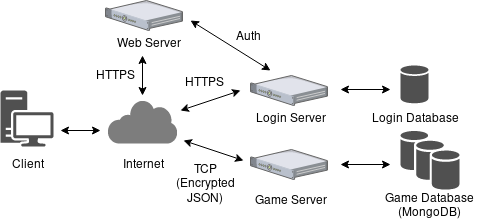

# purplefox Devblog: Part 1 - Introduction & Planning
* By: Austin Jackson (vesche)
* Dated: 09/15/2018

Welcome to the first development blog for a project I'm giving the working title, **purplefox**. This is a work-in-progress massively multiplayer online role-playing game (MMORPG) that I'll be hacking on in my free time. MMORPG's are notoriously complicated, and something I've always wanted to build. Over the past ~5 years I've gained a lot of knowledge in the areas of software development, computer networking, and computer security. I feel that I now have the right skillset to embark on this journey. This will likely be my primary side project for the unforeseen future.

I'm going to talk about high-level design, proposed technologies, concerns, and a current roadmap in this first post. I'm going to specifically focus on planning the client & server architecture. Everything I discuss here is subject to change, I'm learning a lot as I go. 

Here's a high-level diagram I drew up to talk about this project:

## Client-side

Let's talk about the client-side first. The envisioned client will be 2D, cross-platform, and send & recv JSON over TCP.

Here's the technology I'm currently planning on using:
* C/C++
* [SDL 2.0 (Simple DirectMedia Layer)](https://www.libsdl.org/)
* [json-c](https://github.com/json-c/json-c) (or similar)

SDL2 is cross-platform, fast, powerful, and well documented. The downside is I will have to write my own 2D game engine. However, I believe that writing my own engine will have great long-term benefit.

Resources:
* [SDL2 Documentation](http://wiki.libsdl.org/FrontPage)
* [SDL2 API by Category](http://wiki.libsdl.org/APIByCategory)
* [SDL_image Documentation](https://www.libsdl.org/projects/SDL_image/docs/index.html)
* [Beej's Guide to Network Programming](https://beej.us/guide/bgnet/)

## Server-side

The game server architecture is probably the more complicated matter. My goal is for the server-side to be scalable, smartly distributed, authoritative, and secure. A lot to ask for, I know ;D.

Here's the technology I'm currently planning on using:
* Python
* [Twisted](https://twistedmatrix.com/trac/)
* [MongoDB](https://www.mongodb.com/)
* [Docker](https://www.docker.com/)

Resources:
* [Twisted Documentation](https://twistedmatrix.com/trac/wiki/Documentation)
* [Twisted API Documentation](https://twistedmatrix.com/documents/current/api/)
* [txmongo - async driver for twisted/mongo](https://github.com/twisted/txmongo)
* [PyMongo Driver](https://github.com/mongodb/mongo-python-driver)
* [PyMongo Documentation](http://api.mongodb.com/python/current/)

## Concerns

I have a lot of concerns. I think it's important to write them down.

* Expertise. Just want to document a personal & honest concern. I have minimal experience with C network programming, Twisted, and MongoDB. I do however have network programming experience with other languages, have used plenty of other network-oriented libraries, and have used other NoSQL databases. Also, if this project comes to fruition, the client-side will definitely be the largest C project I've ever built. Just throwing it out there that it's a concern that I'll be learning new libraries, APIs, and frameworks as I go.

* Graphics, music, and sound. I am not an artist, musician, or sound designer. I plan to at first use all open-source art & sound. If the project gets large enough, perhaps I'll pay to have art and sound done for the game. The game will likely be a lot of moving squares with no sound for a long time.

* Server-side speed. I'm not sure if Python, Twisted, and TCP is a fast enough stack for an MMORPG. This is likely going to take some considerable testing. High-speed games like multiplayer first person shooters use UDP or RUDP (reliable). However, this game is not planned to be high-speed enough as to require UDP.

* Server-side scale. I'm highly concerned about how the server-side will scale in two primary areas. The first is how geographically separated game servers will share information with one another. I imagine a painful scenario when an MMORPG becomes large enough that it requires a server on the west & east coast of the United States. Somehow user data will need to propagate between servers if you decide to switch. This is a little bit beyond distributed architecture and I imagine this is a database consideration. My goal is to take this problem into consideration early when designing the server and run more than one instance to ensure this won't be a problem. The second concern is the distributed architecture, and the best way of designing this. Probably will take a lot of reading and testing.

* Budget. This is a far future concern, but a valid one. When this game is eventually put on the internet, it will require something like 10+ servers/instance (even in alpha) if done properly. The game server in the high-level diagram above is likely to actually be distributed across several servers. This is simply a $$$ concern, I imagine that hosting something like this would cost several hundred dollars or more per month.

## Roadmap

Here's the current roadmap. My primary goal right now is to get a decent skeleton for the client and server. I'll feel satisfied with my progress if I can get the game client and server talking TCP containing JSON data that updates a player location from an authoritative server and renders that information properly in SDL. Whew- that was a mouthful. Here's what needs to be done:

* Client Skeleton
    * Structure, Makefile, etc.
    * SDL initialization (Window, Renderer, etc)
    * Error handling
    * Primary SDL loop structure (init, user input, update, render)
    * JSON support
    * Network thread
    * Send & recv data interacting with SDL
* Server Skeleton
    * Twisted application structure
    * Protocol design
    * JSON handling
    * Authoritative structure (game state)
    * Initial database interaction structure (driver)

## Commitment to Open-Source
I'd like to close this first development blog by stating that I'm committed to eventually releasing all code for purplefox open-source. It will be easy to release the client-side code when it's in a stable state. However, the server-side code might be difficult to open-source depending on how it is architected. In an eventual post-mortem state, all code will be open-sourced. My hope is that both the client & server code will be released in the long-term so players can run private servers and make mods.

Thanks for reading!