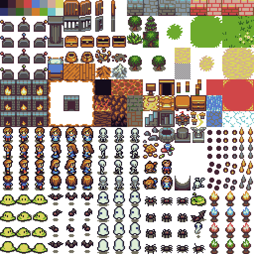
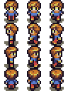
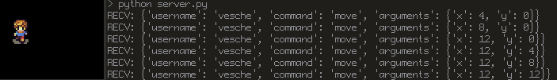

# purplefox Devblog: Part 2 - Client Skeleton
* By: Austin Jackson (vesche)
* Dated: 09/30/2018

Welcome back to the development blog for my work-in-progress MMORPG, **purplefox**. It's been about two weeks since my first devblog, and I've made some great progress since then! I've been focusing work on the client, and I now have a solid foundation for it. In this post I'm going to talk about: what technologies I've decided to use, resources that I found helpful, what I've built so far, and what's next for purplefox.

I've created a [GitHub repository for the purplefox client](https://github.com/vesche/purplefox-client) so if you'd like to see any of the code I discuss in this post, feel free to check it out.

## Client Structure Overview

In my first post, I outlined the following roadmap for the client:

* Structure, Makefile, etc.
* SDL initialization (Window, Renderer, etc)
* Error handling
* Primary SDL loop structure (init, user input, update, render)
* JSON support
* Network thread
* Send & recv data interacting with SDL

I'm happy to report that I've accomplished all of this and then some! Currently the client is ~500 lines of C code. Here's what the current client repo looks like from a file standpoint:

```sh
$ tree
.
|-- LICENSE         # MIT License
|-- Makefile        
|-- README          
|-- cJSON.c         # JSON parser - https://github.com/DaveGamble/cJSON
|-- cJSON.h         
|-- dump.c          # Code dump
|-- error.c         # Error handling
|-- error.h         
|-- main.c          # Entry point, lots of SDL2 code
|-- networking.c    # Networking code
|-- networking.h
|-- payloads.c      # Creates JSON payloads
|-- payloads.h
`-- sheet.png       # Spritesheet - https://opengameart.org/content/tiny-16-basic
```

## Technologies

Here's a bunch of tech I'm using to build this project. It's amazing having so many free & open-source tools, libraries, and resources at my disposal- cheers to the open-source community.

* [C](https://en.wikipedia.org/wiki/C_(programming_language))
    * I'm committed to using straight up ANSI C for this project. I really enjoy programming in C, it feels powerful and badass (read: I'm a geek). The client will be very fast and cross-platform which I'm excited about.
* [SDL 2.0 (Simple DirectMedia Layer)](https://www.libsdl.org/)
    * Awesome cross-platform library that is seriously making everything a breeze. Graphics, keyboard, mouse, audio, threading, and additional libraries that can do things like images & networking (see below). This library is a godsend. The [Wiki](https://wiki.libsdl.org/FrontPage) has been super helpful, I use the [API by Name documentation](https://wiki.libsdl.org/CategoryAPI) frequently.
* [SDL_image 2.0](https://www.libsdl.org/projects/SDL_image/)
    * Great library for SDL that handles loading images, a sprite sheet in my case. It also has really helpful documentation.
* [SDL_net](https://www.libsdl.org/projects/SDL_net/)
    * Finding this SDL library has made this project ten times easier. Network programming in C can get complicated quickly. SDL_net has helped keep the networking code much more clean. It also has great documentation, just like the rest of SDL.
* [cJSON](https://github.com/DaveGamble/cJSON)
    * I tried a few other C JSON libraries before landing on cJSON including [json-c](https://github.com/json-c/json-c) and [pdjson](https://github.com/skeeto/pdjson). I really like how much functionality cJSON allows and that it has a single, easy to use header file. It does what I need and was easy to learn.
* [Tiny 16: Basic](https://opengameart.org/content/tiny-16-basic)
    * As I said in my last post, I'm not an artist. I needed some free placeholder art, and I ended up finding the awesome [OpenGameArt](https://opengameart.org/) website. After a little bit of browsing, I found the "Tiny 16: Basic" sprite sheet by [Sharm](https://opengameart.org/users/sharm). I really like the way it looks, I'm currently using a combined, single sprite sheet a user put together in the comments section.

## Client Networking I - Sending a JSON Payload to the Server

When building a game it's tempting to just want to dive in and start doing game mechanics, player movement, animations, etc. However, this will not be an ordinary game- this is an MMORPG ladies and gents. Therefore, we have to keep our feet on the ground. For the client skeleton some of the most important code to write first is network communication. As I talked about in the first post, the game is going to talk TCP and send & receive JSON payloads. Again, this game is not being designed to be high-speed enough as to require UDP and we will be using JSON because it's 2018, *bro*.

Here's a JSON payload that I came up with, this likely will change over time but suits my needs for now. Everything sent to the server will have the common fields username, command, and arguments. This allows the server to know who we are talking about, what we want to do, and be given the data needed to go along with it.
```json
{
    "username": "vesche",
    "command": "move",
    "arguments": {
        "x": 13,
        "y": 37
    }
}
```

So the first thing we need to do is build our JSON payload in C using cJSON. Since our payloads will always contain a few common fields, we'll create a `payload_init` to start creating the JSON payload. This is mostly a lot of using the cJSON API, see the [README](https://github.com/DaveGamble/cJSON/blob/master/README.md) if you want to learn more.
```c
#include "cJSON.h"

const char *USERSTR = "vesche";

cJSON *payload_init(char *CMDSTR)
{
    cJSON *username = NULL;
    cJSON *command = NULL;

    cJSON *payload = cJSON_CreateObject();

    username = cJSON_CreateString(USERSTR);
    cJSON_AddItemToObject(payload, "username", username);
    command = cJSON_CreateString(CMDSTR);
    cJSON_AddItemToObject(payload, "command", command);

    return payload;
}

char *payload_move(int arg_x, int arg_y)
{
    char *string = NULL;

    char *CMDSTR = "move";
    cJSON *payload = payload_init(CMDSTR);

    cJSON *arguments = NULL;
    cJSON *x = NULL;
    cJSON *y = NULL;

    arguments = cJSON_CreateObject();
    x = cJSON_CreateNumber(arg_x);
    y = cJSON_CreateNumber(arg_y);
    cJSON_AddItemToObject(arguments, "x", x);
    cJSON_AddItemToObject(arguments, "y", y);
    cJSON_AddItemToObject(payload, "arguments", arguments);

    string = cJSON_Print(payload);
    cJSON_Delete(payload);
    return string;
}
```

Next, we need a way to send messages to our server. Using SDL_net we can connect to a server and send a message quite easily.
```c
#include <SDL2/SDL_net.h>
#include <string.h>

const char *server_addr = "localhost";
const int server_port = 1234;
TCPsocket sock;

void connect_to_server()
{
    IPaddress ip;
    SDLNet_ResolveHost(&ip, server_addr, server_port);
    sock = SDLNet_TCP_Open(&ip);
}

int client_send(char *message)
{
    char *data = message;
    int len = strlen(message);
    return SDLNet_TCP_Send(sock, data, len);
}
```

All of this and we still don't have a server, we'll let's fix that. As talked about in my first post, the server will be written in Python & Twisted. For now, we can just make a simple server that will verify we are being sent some data. The next devblog will be focusing on the server architecture, so more to come...
```python
# server.py
from twisted.internet import protocol, reactor, endpoints
import json

class Test(protocol.Protocol):
    def dataReceived(self, data):
        test = json.loads(data)
        print("RECV: {}".format(test))

class TestFactory(protocol.Factory):
    def buildProtocol(self, addr):
        return Test()

endpoints.serverFromString(reactor, "tcp:1234").listen(TestFactory())
```

Now to put this all together we will connect to the server, build a payload, and send it:
```c
connect_to_server();
char *message = payload_move(13, 37);
client_send(message);
```

```sh
$ python server.py
RECV: {'username': 'vesche', 'command': 'move', 'arguments': {'x': 13, 'y': 37}}
---
$ make && ./main.build
```

Hot damn, we're sending JSON!

## Client Networking II - Threading, Receiving, and Sockets- Oh My!

Sending messages to the server ends up being much easier than receiving messages from the server. This is because the client can decide when it wants to send a message, but it cannot decide when it will receive one. Therefore, it must always be ready (independent of its primary execution) to receive a message. This is accomplished by threading, more specifically to run a separate thread for the client to continually receive data and act appropriately on incoming messages.

I want to give a HUGE shout out to the MMORPG [Eternal Lands](http://www.eternal-lands.com/), it's open-source and can be found [here](https://github.com/raduprv/Eternal-Lands). The [main.c](https://github.com/raduprv/Eternal-Lands/blob/master/main.c) and [multiplayer.c](https://github.com/raduprv/Eternal-Lands/blob/master/multiplayer.c) files have been super helpful when coding this. Eternal Lands is a free to play MMORPG written in C using SDL by Radu Privantu and is still online & active to this day, and it's been online for over 15 years!!! Reading through the code for this game has been very helpful. Eternal Lands also uses threading, you can see it's client recv loop [here](https://github.com/raduprv/Eternal-Lands/blob/master/multiplayer.c#L2332).

First, let's create some code to receive messages. Then we'll create our `client_loop` which will run inside of our new thread. The `client_loop` first checks if the server has become disconnected, and then it checks the socket for data for 100ms (so ten times a second). If there is data on the socket it will receive the data and then handle the incoming server message. The SDL_net socket code is pretty interesting, check the SDL_net documentation or see my [networking.c](https://github.com/vesche/purplefox-client/blob/master/networking.c#L17) for more.
```c
#include <SDL2/SDL_net.h>

char *client_recv()
{
	int result;
	char *message = malloc(sizeof(char) * RECV_MAX_LEN);
	result = SDLNet_TCP_Recv(sock, message, RECV_MAX_LEN);
	return message;
}

int client_loop()
{
	for (;;) {
		if (disconnected) {
			break;
		} else if (SDLNet_CheckSockets(set, 100) <= 0 || !SDLNet_SocketReady(sock)) {
			// if no data loop and check again, with 100ms delay time
			continue;
		}
		char *response = client_recv();
		if (response)
			handle_incoming(response);
	}
	return 1;
}
```

Next, we need to actually create the thread. SDL, once again being badass, has threading capabilities! We'll use [SDL_CreateThread](https://wiki.libsdl.org/SDL_CreateThread) and then use [SDL_WaitThread](https://wiki.libsdl.org/SDL_WaitThread) to wait for the thread to finish up (on server disconnect).
```c
// main.c
#include <SDL2/SDL.h>
#include "networking.h"

// do things...

SDL_Thread *network_thread;
network_thread = SDL_CreateThread(client_loop, "client_loop", (void *)NULL);
if (network_thread == NULL) {
    return 1;
}

// do more things...

int thread_return_value;
SDL_WaitThread(network_thread, &thread_return_value);
printf("Thread returned: %d\n", thread_return_value);
```

Fantastic, now we have a separate thread for receiving messages from the server.

In our client loop, I breezed over `handle_incoming` which (duh) handles the incoming messages. Because our client is sending & receiving JSON, we'll need to parse the incoming JSON data and do things with it.
```c
void handle_incoming(char *message)
{
	const cJSON *command = NULL;

	cJSON *json = cJSON_Parse(message);
	command = cJSON_GetObjectItemCaseSensitive(json, "command");
	unsigned int cmd = command->valueint;

	switch(cmd) {
		case 1:
			printf("Do something here\n");
			break;
		case 2:
			printf("Do something else here\n");
			break;
	}

end:
	cJSON_Delete(json);
	return;
}
```

## Player Movement - Sprite Animation & Sending Player Location

Now that we can send & receive messages to and from the server, it's time to do something actually useful with it. The first natural thing to want to do is player movement. So to start this process, we'll get a player sprite moving around the screen and reporting its location to the server.

I'm going to skip over a bit of SDL initialization, see the purplefox [main.c](https://github.com/vesche/purplefox-client/blob/master/main.c#L14) for that. If you're interested in learning SDL2 basics check out, [Writing 2D Games in C using SDL by Thomas Lively](https://www.youtube.com/watch?v=yFLa3ln16w0) and the [associated GitHub repo](https://github.com/tlively/sdl_seminar).


Here's the sprite sheet (from Tiny 16: Basic) that I'm using:



The player I'm going to add into the game is on that sprite sheet at (0, 256):



After we initialize and setup SDL2 we will have a window and renderer. We'll first create two `SDL_Rect`'s for our player and player position. We'll load in our sprite sheet using `IMG_Load` from SDL_image. Then we can use `SDL_QueryTexture` to get the width and height of our sprite sheet. We'll then divide by how many sprites we have width & height wise (16 by 16 for our sprite sheet). We'll then set our player SDL_Rect to x, y (0, 256) so it's fixed to where the player sprites are on the sprite sheet. Then, we'll set our player_position SDL_Rect x, y to (0, 0) which is the location of our player corresponding to the top left of the sprite. Finally, we can render the sprite.
```c
SDL_Rect player;
SDL_Rect player_position;

surface = IMG_Load("sheet.png");
texture = SDL_CreateTextureFromSurface(renderer, surface);
SDL_FreeSurface(surface);

int frame_width, frame_height;
int texture_width, texture_height;
SDL_QueryTexture(texture, NULL, NULL, &texture_width, &texture_height);
frame_width = texture_width / 16;   // 16 x 16 sprites on the sprite sheet
frame_height = texture_height / 16;

player.x = 0;   // location of player on sprite sheet (0, 256)
player.y = 256;
player.w = frame_width;
player.h = frame_height;

player_position.x = player_position.y = 0;  // current player position (0, 0)
player_position.w = player_position.h = 32; // size of player (32, 32)

SDL_RenderCopy(renderer, texture, &player, &player_position);
SDL_RenderPresent(renderer);
```

And, here's what it looks it:


Not that exciting, let's get the little guy to move around and let the server know where we are. We'll now need to create a game loop, handle some keyboard input, and send our location to the server. We can modify our `player.y` value when we want to change the row of our sprite sheet (for changing direction) and our `player.x` value to cycle through the animation. I created a `frame_time` variable which loops through my animations when the player is moving. Putting together some of the things we built above it's now easy to create a JSON payload for our location and send it off to the server every time we move.
```c
bool quit = false;
int frame_time = 0;
int player_speed = 4;

SDL_Event event;

while (!quit)
{
    SDL_WaitEvent(&event);
    bool moved = false;

    switch (event.type)
    {
        case SDL_KEYDOWN:
            switch (event.key.keysym.sym)
            {
                case SDLK_q:
                    quit = true;
                    break;
                case SDLK_LEFT:
                    player.y = 288;
                    player_position.x -= player_speed;
                    moved = true;
                    break;
                case SDLK_RIGHT:
                    player.y = 320;
                    player_position.x += player_speed;
                    moved = true;
                    break;
                case SDLK_UP:
                    player.y = 352;
                    player_position.y -= player_speed;
                    moved = true;
                    break;
                case SDLK_DOWN:
                    player.y = 256;
                    player_position.y += player_speed;
                    moved = true;
                    break;
            }
    }

    if (moved) {
        char *message = payload_move(player_position.x, player_position.y);
        client_send(message);

        frame_time++;
        if (frame_time == 4) {
            frame_time = 0;
            player.x += frame_width;
            if (player.x >= 96)
                player.x = 0;
        }
    }

    SDL_RenderClear(renderer);
    SDL_SetRenderDrawColor(renderer, 0, 0, 0, 255);
    SDL_RenderCopy(renderer, texture, &player, &player_position);
    SDL_RenderPresent(renderer);
}
```

It's working!!! How cool is that?



## What's Next?

Oh boy, what's not next?

The server architecture will likely be the focus of the next few posts. Although working with C has been very fun, I'm a much better Python programmer so I'm excited to get working on the server-side. The large milestone at the moment will be to get authoritative server player movement with multiple players connected and then work toward interpolated movement. This will take a decent amount of change on the client-end as well, the client will need to receive player locations and render them. I imagine a `game.c` file is in the future, but I'm very happy with client structure thus far.

Well this ended up being a giant post. Thanks for reading! Until next time, vesche.
